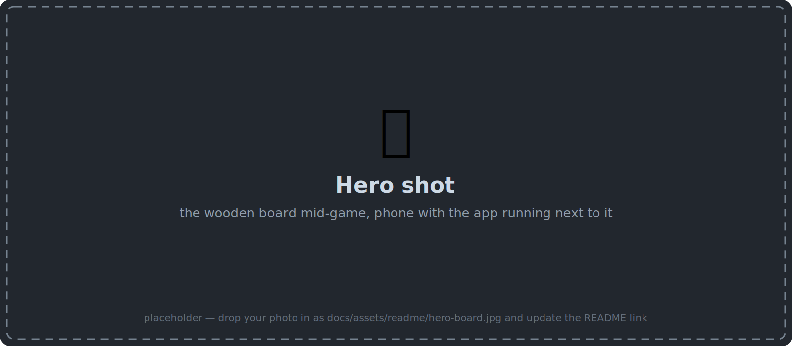
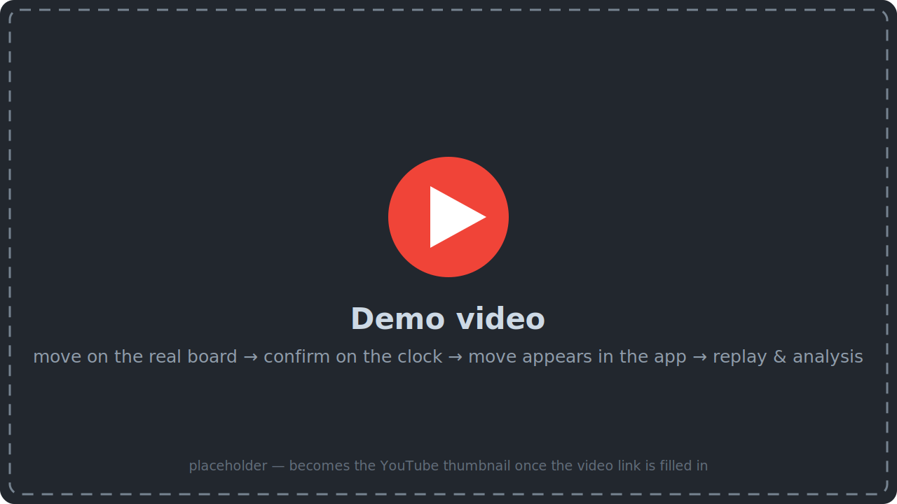
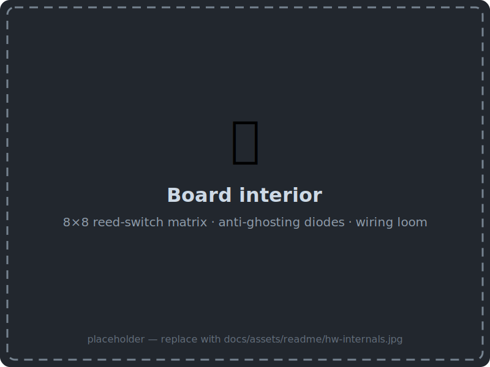
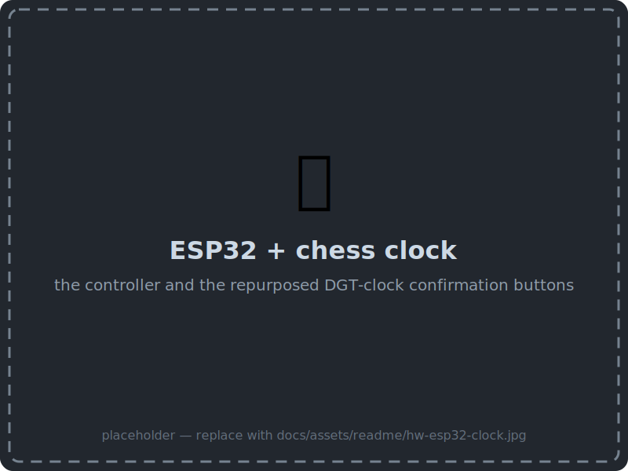
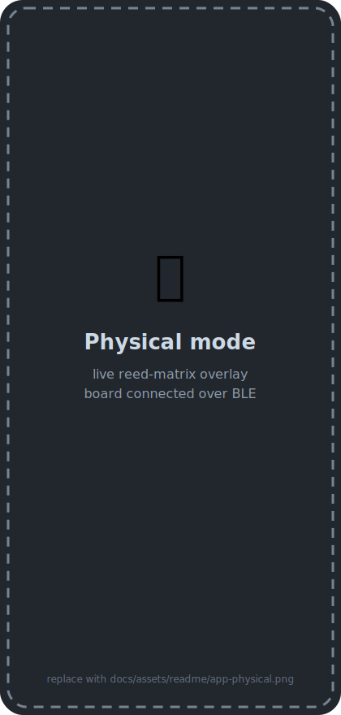
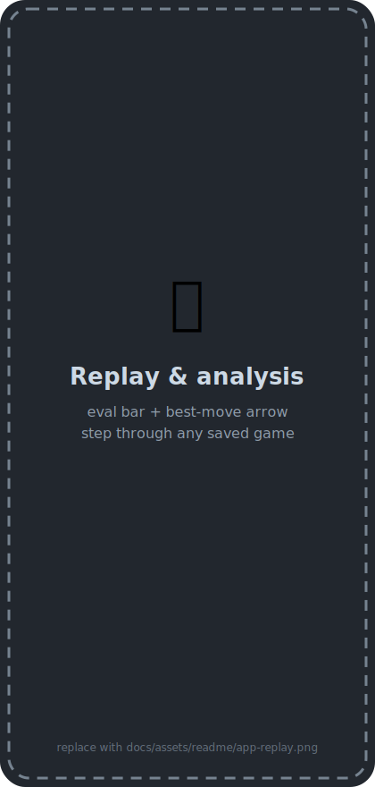
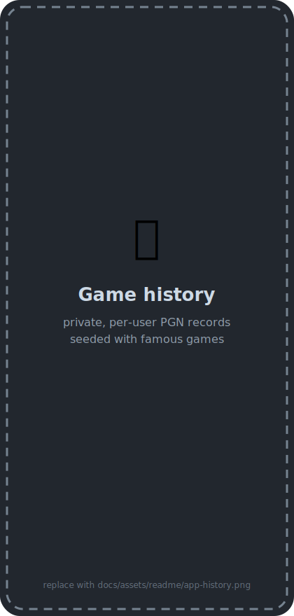

<div align="center">

# ♟️ Smart Chessboard

**A DIY wooden chessboard that records, replays and analyzes every game played on it.**

[](SmartChessboard/README.md)
[](SmartChessboard/README.md)
[](firmware/README.md)
[](docs/reference/contract-surfaces.md)
[](supabase/README.md)

<!-- HERO PHOTO: the wooden board mid-game with the phone running the app next to it.
     Drop the photo in as docs/assets/readme/hero-board.jpg and change the src below. -->


*A hand-built reed-switch board, an ESP32, and one Kotlin codebase that turns
casual over-the-board games into a permanent, analyzable chess archive.*

## ▶️ See it in action

<!-- DEMO VIDEO: once the YouTube link is known, replace the block below with:
     [](https://www.youtube.com/watch?v=YOUTUBE_ID)
     (swap YOUTUBE_ID in both URLs) -->
[](https://www.youtube.com/watch?v=YOUTUBE_ID)

</div>

## The story

My friends and I play chess on a physical wooden board — and those games used to
vanish the moment they ended: unrecorded, unreplayable, unanalyzable. Commercial
smart boards solve that, but they are expensive and closed. So this one is built
from scratch: a reed switch under every square, a magnet in every piece, and an
ESP32 that streams what happens on the board over Bluetooth LE.

The board itself is deliberately *dumb* — it only reports raw piece lifts, placements
and button presses. Everything smart happens in the app: a Kotlin Multiplatform
client (one codebase for Android, iOS and web) resolves those raw sequences into
moves, validates them against the **full rules of chess** (castling, en passant,
promotions, pins, checks), and saves every accepted move as PGN — locally and to the
cloud. Each side confirms its move with a button on a repurposed DGT chess clock, so
the game keeps its physical rhythm; no touchscreen needed mid-play.

After the game, any device signed into the account can replay the record move by
move and analyze every position with engine evaluations. Games played on the screen
(pass-and-play) flow through exactly the same pipeline — the physical board is one
input channel, not a special case.

## Gallery

<!-- HARDWARE PHOTOS: replace the two SVG placeholders with real photos
     (same file names, .jpg — then update the extensions here). -->
<p align="center">
  
  
</p>

<!-- APP SCREENSHOTS: replace with real captures (same file names, .png). -->
<p align="center">
  
  
  
</p>

## Features

- **Google sign-in** with a private, per-user game history (Supabase Auth + Postgres RLS).
- **Digital pass-and-play** on Android, iOS, and web — full legality validation
  (check, pins, castling, en passant, promotion), auto-detected checkmate/stalemate,
  crash-safe auto-save (local write-ahead journal + cloud backup).
- **Physical-board play** (Android + iOS) — piece lifts/places streamed over BLE are
  resolved into legal moves and confirmed with per-side chess-clock buttons; illegal
  or ambiguous sequences are rejected with a diagnostics-assisted recovery path, and
  an in-progress game survives app restarts and BLE drops.
- **Live reed-switch diagnostics** — per-square occupancy view of the real board.
- **Replay & analysis** — step through any saved game; position evaluations and best
  moves via Lichess Cloud Eval with a Stockfish fallback (Chess-API.com), cached
  server-side per position.
- **History management** — hard delete with confirmation; new accounts start with
  eight famous historical games pre-seeded.

## How it fits together

```
┌──────────────┐  BLE GATT    ┌───────────────────────────┐  HTTPS    ┌─────────────────┐
│ ESP32 board  │─────────────>│ KMP app                   │──────────>│ Supabase Cloud  │
│ 8×8 reeds    │ lifts/places │ Android · iOS · Web(Wasm) │ REST/auth │ Postgres + RLS  │
│ 2 buttons    │ + confirms   │ rules engine · PGN · UI   │           │ Auth · Edge Fn  │
└──────────────┘              └───────────────────────────┘           └─────────────────┘
```

- The board is a **dumb sensor** — it reports raw square transitions and button
  presses only; the app derives the moves and enforces chess legality.
- **PGN is the source of truth** for every game; FEN is derived for replay/analysis.
- The backend is **configuration, not code**: Postgres schema + RLS + one Edge
  Function. Clients call Supabase directly — there is no bespoke server.
- The contract between the three parts (BLE protocol, API shapes, schema) lives in
  [`docs/reference/contract-surfaces.md`](docs/reference/contract-surfaces.md).

## Repository layout

| Path | What it is |
| --- | --- |
| [`SmartChessboard/`](SmartChessboard/README.md) | Kotlin Multiplatform app — Compose UI, chess rules engine, BLE client |
| [`firmware/`](firmware/README.md) | ESP32 firmware — reed-matrix scan + BLE GATT peripheral |
| [`supabase/`](supabase/README.md) | Backend as code — migrations, RLS, `lichess-eval` Edge Function |
| [`context/`](context/) | Product docs driving the workflow: [PRD](context/foundation/prd.md), [firmware PRD](context/foundation/prd-firmware.md), [tech stack](context/foundation/tech-stack.md), [roadmap](context/foundation/roadmap.md), per-change plans |
| [`docs/`](docs/) | Cross-cutting reference — most importantly [`contract-surfaces.md`](docs/reference/contract-surfaces.md) |

Each sub-project README covers its own setup, build, run, and test instructions.
The `AGENTS.md` files (root + one per sub-project) add rules for AI coding agents
and contributors.

## Status

All MVP roadmap slices are implemented and verified on real hardware, including
physical play over BLE. See the [roadmap](context/foundation/roadmap.md) for
per-slice status and what remains (BLE connectivity hardening).
